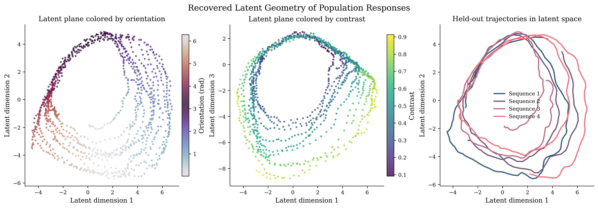
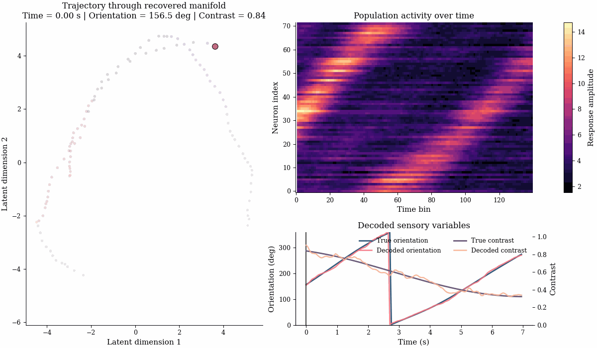
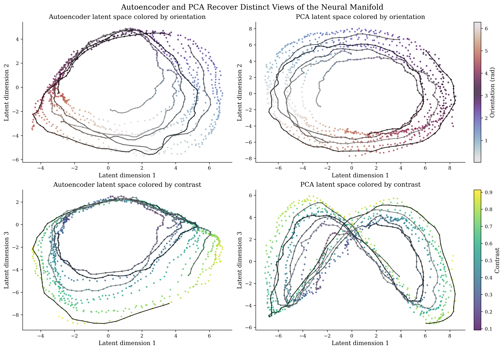
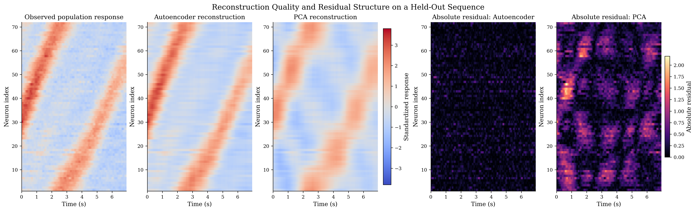
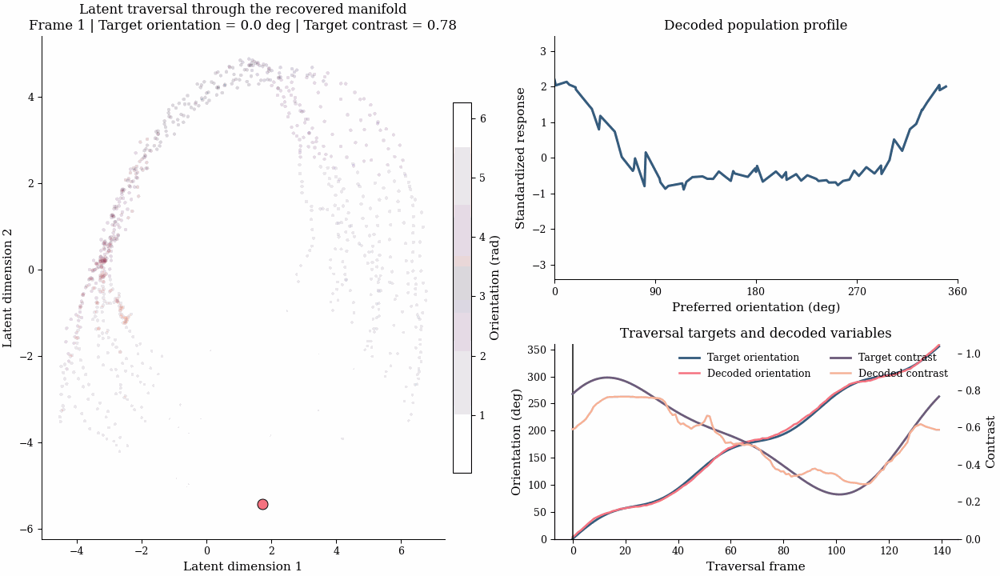

<h1 align="center">From Spikes to Manifold</h1>

<p align="center">
  A computational neuroscience project on recovering low-dimensional neural geometry from mixed-selectivity population activity.
</p>

<p align="center">
  <strong>Autoencoder vs PCA</strong> • <strong>Latent state recovery</strong> • <strong>Paper-style figures</strong> • <strong>Runnable end-to-end pipeline</strong>
</p>

<p align="center">
  
</p>

<p align="center">
  
</p>

## Snapshot

| What stands out | Why it matters |
| --- | --- |
| `10x` lower reconstruction error than PCA | The nonlinear latent model captures structure that the linear baseline leaves behind. |
| `0.973` contrast `R^2` | The recovered state remains highly informative about continuous sensory variables. |
| `0.999` trustworthiness | The learned manifold preserves local geometry extremely well. |

## Why It Is Interesting

- Combines computational neuroscience, representation learning, and quantitative evaluation in one reproducible repo.
- Compares a nonlinear model against a strong linear baseline instead of presenting a single-model success story.
- Produces deliverables that read like a mini research artifact: metrics, figures, animations, and saved analysis outputs.

## Result Table

| Metric | Autoencoder | PCA |
| --- | ---: | ---: |
| Reconstruction MSE | 0.0284 | 0.2802 |
| Orientation similarity | 0.9984 | 0.9991 |
| Orientation MAE (deg) | 2.69 | 1.84 |
| Contrast `R^2` | 0.9729 | 0.9695 |
| Trustworthiness | 0.9991 | 0.9971 |

The core tradeoff is easy to read: the autoencoder is much better at reconstruction, while PCA remains very competitive on orientation recovery and global geometry.

## Visual Highlights

<p align="center">
  
  
</p>

<p align="center">
  
  
</p>

## What This Project Shows

- A neural population can be compressed into a low-dimensional state while retaining orientation and contrast structure.
- Linear and nonlinear embeddings recover different aspects of the same neural geometry.
- Visual evidence and metric evidence tell the same story, which makes the project strong as both a research piece and an engineering showcase.

## Quick Start

```bash
cd /home/aimldl/neural_manifold_study
python3 -m pip install -r requirements.txt
python3 scripts/run_end_to_end.py --config configs/default.yaml
```

Faster smoke run:

```bash
cd /home/aimldl/neural_manifold_study
python3 scripts/run_end_to_end.py --config configs/smoke.yaml --output outputs/smoke_run
```

## Repository Layout

```text
configs/                  experiment configuration files
scripts/run_end_to_end.py command-line entrypoint
neural_manifold/          package with data, models, metrics, and plotting code
docs/readme_assets/       tracked showcase assets for GitHub preview
outputs/                  local figures, animations, metrics, and saved artifacts
```

## Deliverables

- Scientific figures in `PNG`
- Preview animations in `GIF`
- Full-resolution animations in `MP4`
- Saved latent and model artifacts in `NPZ`
- Metric summaries in `CSV` and `JSON`

## Selected Assets

- [`recovered_latent_manifold.png`](docs/readme_assets/recovered_latent_manifold.png)
- [`ae_vs_pca_manifold.png`](docs/readme_assets/ae_vs_pca_manifold.png)
- [`reconstruction_residuals.png`](docs/readme_assets/reconstruction_residuals.png)
- [`manifold_trajectory.gif`](docs/readme_assets/manifold_trajectory.gif)
- [`latent_traversal.gif`](docs/readme_assets/latent_traversal.gif)

<details>
<summary>More Details</summary>

### Study Question

Can a compact latent representation recover the geometry of a neural population that mixes orientation and contrast selectivity while remaining robust to noise and partial neuron dropout?

### Evaluation

- reconstruction MSE on held-out responses
- orientation similarity and orientation error in degrees
- contrast decoding `R^2`
- manifold trustworthiness
- pairwise-distance correlation
- robustness under neuron dropout

### Output Package

Each run writes a deterministic output directory under `outputs/<run_name>/` with:

- `artifacts/dataset.npz`
- `artifacts/autoencoder_model.npz`
- `artifacts/pca_model.npz`
- `artifacts/latent_representations.npz`
- `artifacts/latent_traversal.npz`
- `metrics/summary_metrics.csv`
- `metrics/summary_metrics.json`
- `figures/figure_01_tuning_panel.png`
- `figures/figure_02_population_heatmap.png`
- `figures/figure_03_latent_manifold.png`
- `figures/figure_04_robustness_metrics.png`
- `figures/figure_05_ae_vs_pca_manifold.png`
- `figures/figure_06_reconstruction_residuals.png`
- `animations/manifold_trajectory.mp4`
- `animations/manifold_trajectory.gif`
- `animations/latent_traversal.mp4`
- `animations/latent_traversal.gif`

</details>
